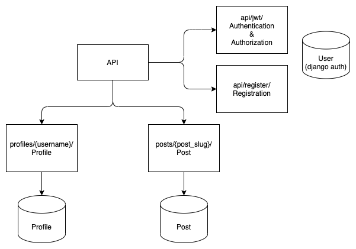
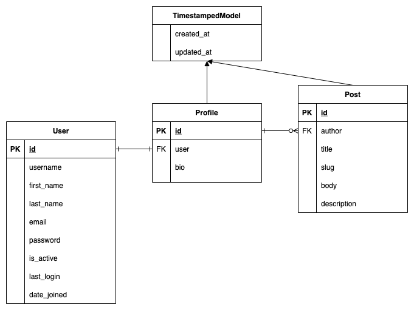

# medium-clone

> 블로그 medium을 클론해서 만든 REST API

## API 구조 및 상세 설명

- 모든 API 앞에는 `/api/`를 붙여야한다.

### authentication

| url              | method | description                                |
| ---------------- | ------ | ------------------------------------------ |
| `register/`      | `POST` | 유저를 등록한다.                           |
| `jwt/`           | `POST` | access token과 refresh token을 발급받는다. |
| `jwt/refresh/`   | `POST` | access token을 갱신한다.                   |
| `jwt/blacklist/` | `POST` | refresh token을 차단한다.                  |

### posts

| url                       | method   | description                             |
| ------------------------- | -------- | --------------------------------------- |
| `posts/`                  | `POST`   | 포스트를 생성한다.                      |
| `posts/?author={author}/` | `GET`    | author가 작성한 포스트 목록을 보여준다. |
| `posts/{slug}/`           | `GET`    | slug에 해당하는 포스트를 보여준다.      |
| `posts/{slug}/`           | `PATCH`  | slug에 해당하는 포스트를 업데이트한다.  |
| `posts/{slug}/`           | `DELETE` | slug에 해당하는 포스트를 삭제한다.      |

### profiles

| url                    | method  | description                                |
| ---------------------- | ------- | ------------------------------------------ |
| `profiles/<username>/` | `GET`   | username에 해당하는 프로필을 보여준다.     |
| `profiles/<username>/` | `PATCH` | username에 해당하는 프로필을 업데이트한다. |

## DB

## Package Version

- python: 3.8, 3.9
- Django: 3.1.13
- djangorestframework: 3.12.0
- djangorestframework-simplejwt: 4.8.0
